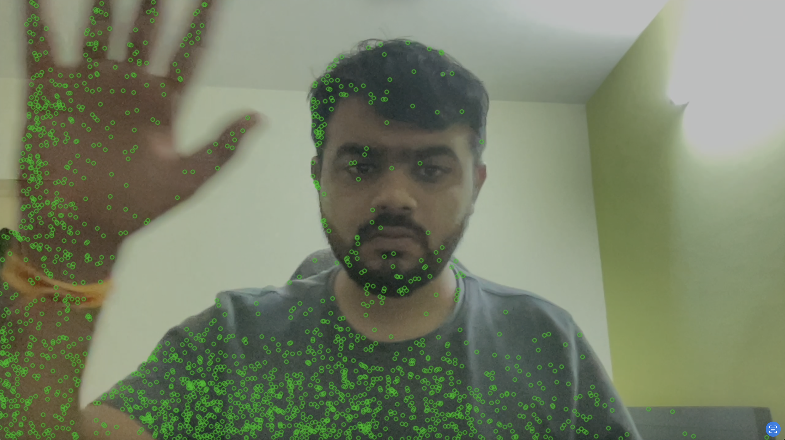

# 🎥 FAST Feature Detection  

This demo performs **feature detection using the FAST algorithm** on live webcam frames.  

### 🔧 Steps Involved  
1. Capture frames from the webcam  
2. Convert each frame to grayscale  
3. Detect keypoints using the **FAST algorithm**  
4. Draw detected keypoints (green dots) on the frame  
5. Display the result in a window called **"FAST Features"**  

---

### 📌 Output Demo  
[▶️ Watch the output video](output.mp4)  

---

### Example Frame (Screenshot)  
  
