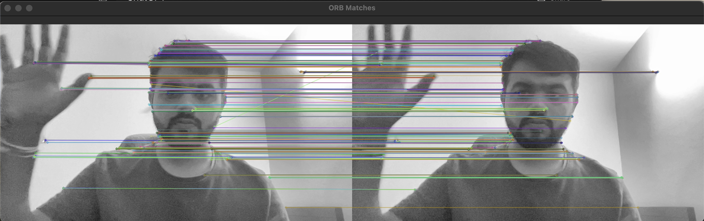

# 🎥 ORB Feature Tracking  

This demo performs **feature detection and tracking using ORB** on live webcam frames.  

### 🔧 Steps Involved  
1. Capture frames from the webcam in real-time  
2. Detect ORB keypoints and descriptors in each frame  
3. Match keypoints between the previous and current frame  
4. Filter out poor matches  
5. Draw good matches to visualize movement of features between frames  

Essentially, this acts as a **simple visual tracking system using ORB**.  

---

### 📌 Output Demo  
[▶️ Watch the output video](ORB_Demo.mov)  

---
### Example Frame
 
