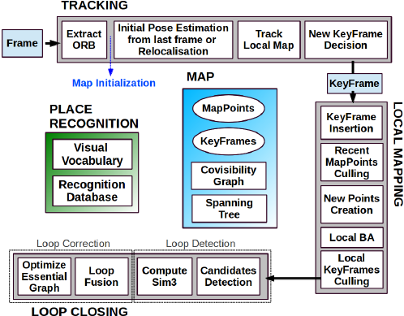

# Lightweight Real-Time SLAM System with Monocular Vision and CUDA C++

## Project Overview
This project focuses on building a **lightweight, real-time SLAM (Simultaneous Localization and Mapping) system** that uses **monocular vision** as its primary input.  
The system leverages **CUDA C++ acceleration** to handle computationally heavy tasks efficiently, enabling fast and accurate environment mapping and camera pose tracking.

---

## Key Features
- **Monocular Vision Input**  
  Uses a single camera stream for localization and mapping, making the system cost-effective and widely deployable.

- **Real-Time Performance**  
  Designed for real-time operation on embedded devices such as NVIDIA Jetson boards and desktop GPUs.

- **CUDA-Accelerated Modules**  
  - Feature extraction (e.g., ORB, FAST, or BRIEF descriptors).  
  - Parallelized descriptor matching for faster correspondence search.  
  - GPU-based image processing kernels for efficient frame handling.

- **Camera Pose Tracking**  
  Continuously estimates the camera’s position and orientation with respect to the environment.

- **Environment Mapping**  
  Builds a sparse or semi-dense map of the scene, useful for robotics, AR/VR, and autonomous navigation.

---

## System Architecture

1. **Input**  
   Monocular camera feed (real-time video).

2. **Feature Extraction (CUDA)**  
   - Detect and describe keypoints in each frame.  
   - GPU acceleration ensures fast feature computation.

3. **Feature Matching (CUDA)**  
   - Match features between consecutive frames.  
   - Leverages parallelism for efficient descriptor comparison.

4. **Pose Estimation**  
   - Uses matched features to estimate camera motion.  
   - Relies on epipolar geometry and perspective-n-point (PnP) solvers.

5. **Map Construction**  
   - Updates the environment map incrementally.  
   - Maintains keyframes and 3D points for localization.

6. **Output**  
   - Real-time camera pose.  
   - 3D map of the environment.

---

## Applications
- **Robotics**: Autonomous navigation in unknown environments.  
- **AR/VR**: Accurate camera tracking for immersive experiences.  
- **Drones**: Lightweight SLAM for UAV navigation.  
- **Autonomous Vehicles**: Low-cost visual localization alternative.

---

## Why CUDA?
- Feature extraction and matching are some of the most computationally expensive parts of SLAM.  
- CUDA parallelizes these tasks across thousands of GPU threads, providing significant speedup.  
- This enables the system to run on real-time constraints even with limited hardware (e.g., Jetson Nano, Jetson Xavier).

---

## Future Work
- Integrating loop closure to handle drift over long trajectories.  
- Extending to stereo or RGB-D cameras for improved depth accuracy.  
- Optimizing GPU kernels for energy-efficient embedded platforms.  
- Adding IMU fusion for robustness in low-texture environments.

---

## Summary
This project delivers a **real-time, lightweight SLAM system** that combines **monocular vision** with **CUDA C++ acceleration** to achieve fast feature extraction, efficient matching, and reliable environment mapping.  
It demonstrates how GPU computing can push the limits of SLAM on both embedded and desktop platforms.
